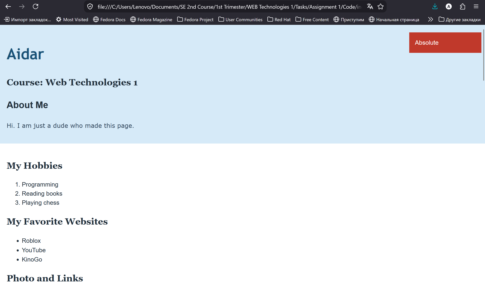
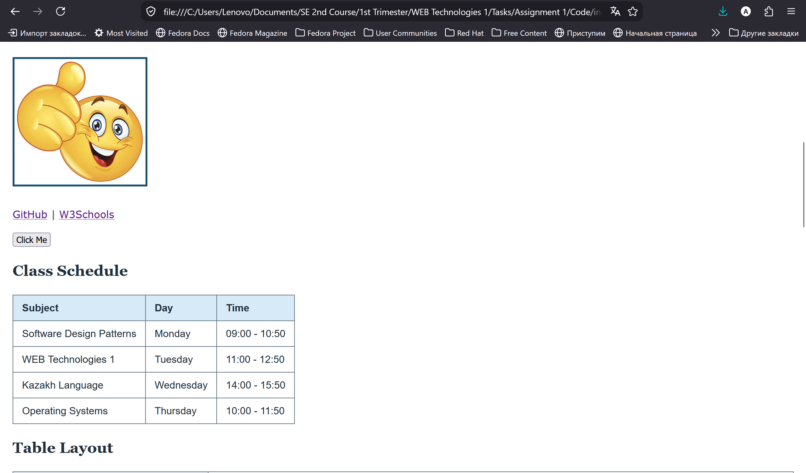
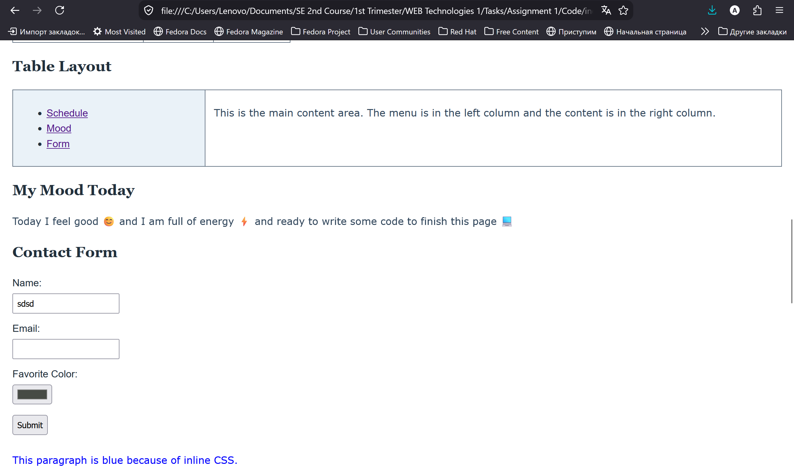
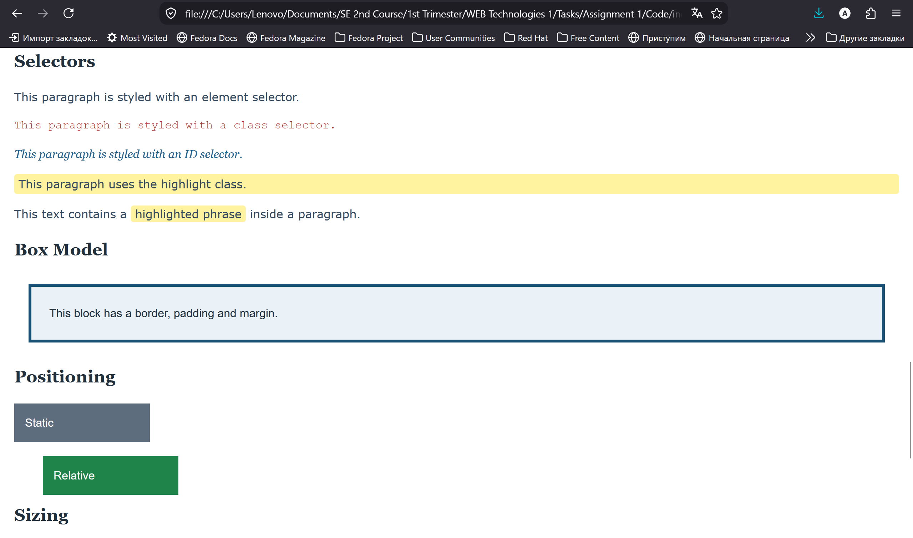
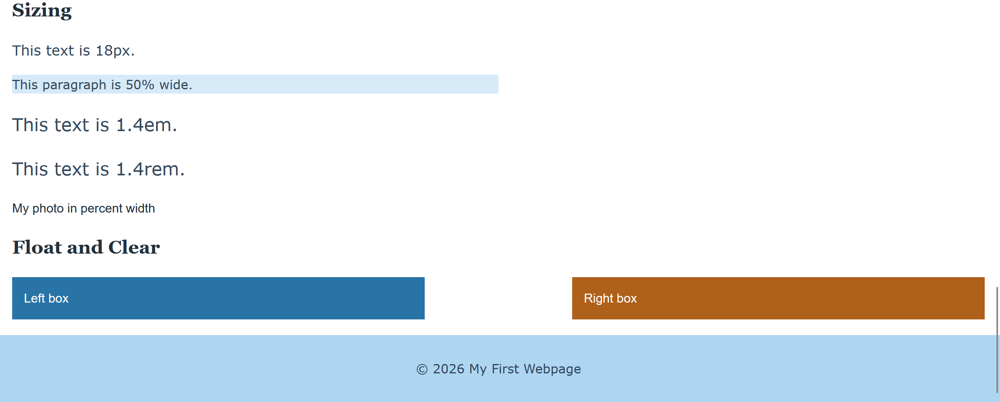

# Assignment 1. Front-End: HTML and CSS

**Name:** Aidar Murat
**Group:** SE - 2539

**Published website:** https://github.com/ayduh/WEB-Tech-Assignment-1

## Objective

Create a simple personal webpage using HTML and CSS, and publish it online with GitHub Pages.

### Step 0. Create a new HTML file named index.html
Add the basic HTML boilerplate and title the page "My First Webpage".

### Step 1. Structure text using HTML tags
Add headings `<h1>` to `<h3>` with name, course and "About Me", and a short paragraph.

### Step 2. HTML Lists
Create an ordered list of hobbies and an unordered list of favorite websites.

### Step 3. Images and Links
Insert a photo with `` and add at least two links with `<a>`.

### Step 4. HTML Buttons
Add a button with the text "Click Me".

### Step 5. Tables
Create a table with the columns "Subject", "Day" and "Time" and fill in a weekly class schedule.

### Step 6. Using Tables for Layout (Optional Challenge)
Create a two-column layout with a table: menu on the left, content on the right.

### Step 7. Typing Emojis
Add at least 3 emojis inside a paragraph about today's mood.

### Step 8. HTML Forms
Create a form with Name, Email, Favorite Color and a Submit button.

### Step 9. Intro to CSS
Add styling to the existing HTML file.

### Step 10. Inline CSS
Change the color of one paragraph with an inline style.

### Step 11. Internal CSS
Use `<style>` inside `<head>` to set the body background color and the heading font.

### Step 12. External CSS
Create `style.css`, link it to the HTML file and move the CSS rules into it.

### Step 13. CSS Syntax & Selectors
Use element, class and ID selectors with different colors and fonts.

### Step 14. Classes vs. IDs
Create the `.highlight` class for several elements and the `#main-heading` ID for the main `<h1>`.

### Step 15. Favicons
Add a favicon to the site.

### Step 16. HTML Divs
Group the content into header, main content and footer with `
` and style them with background colors and padding.

### Step 17. Box Model
Add borders, margins and padding to elements.

### Step 18. CSS Positioning
Create elements with static, relative and absolute positions.

### Step 19. CSS Sizing
Use px, %, em and rem units for headings, text and images.

### Step 20. Float and Clear
Create two boxes floated left and right and use `clear` to fix the layout.

### Step 21. Publish Your First Website
Publish the website with GitHub Pages.

## Web Page screenshots

## Final reflection
This small project for the assignment was quite interesting. Looking how my web page is starts looking better to the end was kind of satisfying considering it looked ugly at the start (because of no css editing).